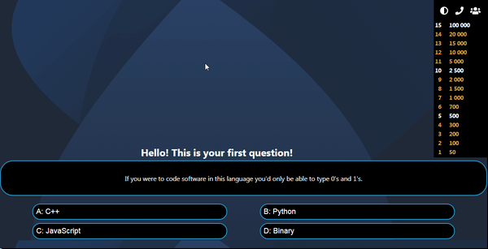

## Who-Wants-to-Be-a-Millionaire Game

This is an implementation of the classic **Who Wants to Be a Millionaire** Game with React 

Live Demo: https://nuri-niyazi.github.io/become-rich-exam/



## Technologies used:

* React
* Axios
* ES6
* [Trivia Database](https://opentdb.com/) as the back end.

Prerequisites
-------------
- make sure you have **Node** and **npm** in your computer

Getting Started
-------------

The easiest way to get started is to clone the repository:

```bash
# Get the latest snapshot
git clone https://github.com/nuri-niyazi/become-rich-exam.git

# Change directory
cd become-rich-exam

# Install NPM dependencies
npm install

# Simply build and start your app
npm start


```
- Go to http://localhost:3000/ from your browser
